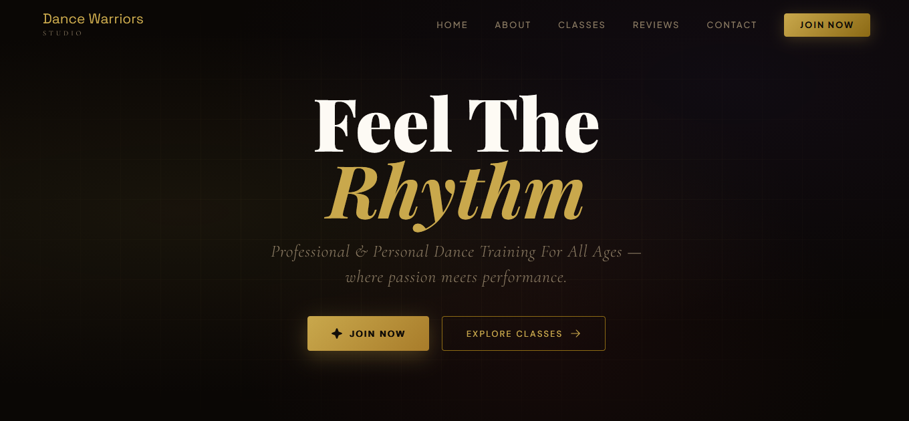

# 💃 Dance Warriors Studio

> A modern, premium, fully responsive dance academy website built with HTML, CSS, and JavaScript — featuring smooth animations, marquee reviews, class schedule, and a secure contact form.

🔗 **Live Site:** [dancewarriors.vercel.app](https://dancewarriors.vercel.app)

---

## 📸 Preview



---

## ✨ Features

- 🎨 **Premium Dark UI** — Elegant gold & dark theme with glassmorphism cards
- 📱 **Fully Responsive** — Mobile-first design with right-side slide drawer navigation
- ⭐ **Marquee Reviews** — Infinite auto-scrolling testimonial cards (pause on hover)
- 📬 **Contact Form** — Full validation + Formspree integration via Vercel serverless function
- 🔒 **Secure API** — Formspree key hidden in Vercel environment variables, never exposed in code
- ✅ **Success Modal** — Animated confirmation popup on form submission
- 🌀 **Scroll Reveal** — Fade-up animations triggered on scroll using IntersectionObserver
- 🔝 **Phosphor Icons** — Clean SVG icon system throughout the UI

---

## 🛠️ Built With

| Technology | Purpose |
|---|---|
| HTML5 | Structure & markup |
| CSS3 | Styling, animations, glassmorphism |
| JavaScript | Interactivity & logic |
| [Phosphor Icons](https://phosphoricons.com/) | SVG icon system |
| [Formspree](https://formspree.io/) | Contact form backend |
| [Vercel](https://vercel.com/) | Hosting, deployment & serverless functions |

---

## 📁 Project Structure

```
dance-warriors-studio/
├── index.html              ← Main website
├── styles.css              ← All styles & animations
├── script.js               ← JS logic (navbar, counters, form, marquee)
├── README.md
├── .env                    ← Local only — never pushed (FORMSPREE_URL)
├── .gitignore
├── api/
│   └── contact.js          ← Vercel serverless function (reads .env securely)
└── assets/
    ├── dance-master.jpg
    ├── favicon.png
    └── logo.jpeg
```

---

## 📋 Sections

| Section | Description |
|---|---|
| **Hero** | Full-screen with animated shapes, floating orbs, CTA buttons |
| **About** | Studio story, mission/vision cards, animated student & award counters |
| **Schedule** | Weekly class timetable — Friday, Saturday, Sunday + personal training |
| **Reviews** | Infinite marquee with 5 real student testimonials |
| **Contact** | Validated form with Formspree submission + success modal |

---

## 🔒 Environment Variables

This project uses a Vercel serverless function to keep the Formspree key secure.

**Local development — create a `.env` file:**
```bash
FORMSPREE_URL=https://formspree.io/f/YOUR_FORM_ID
```

**Production — add in Vercel Dashboard:**
```
Vercel → Project → Settings → Environment Variables
Key:   FORMSPREE_URL
Value: https://formspree.io/f/YOUR_FORM_ID
```

The `.env` file is listed in `.gitignore` and is **never pushed to GitHub**.

---

## 🚀 Getting Started

**Clone the repo:**
```bash
git clone https://github.com/YOUR_USERNAME/dance-warriors-studio.git
cd dance-warriors-studio
```

**Create your `.env` file:**
```bash
echo "FORMSPREE_URL=https://formspree.io/f/YOUR_FORM_ID" > .env
```

**Deploy to Vercel:**
```bash
# Option 1 — Connect GitHub repo to Vercel (recommended)
# vercel.com → New Project → Import GitHub repo → Deploy

# Option 2 — Vercel CLI
npm install -g vercel
vercel --prod
```

---

## 📬 Contact

| Platform | Link |
|---|---|
| 🌐 Studio Site | [dancewarriors.vercel.app](https://dancewarriors.vercel.app) |
| 📸 Instagram | [@dance_warriors_studio](https://www.instagram.com/dance_warriors_studio/) |
| 💬 WhatsApp | [Join Group](https://chat.whatsapp.com/JRU1rZndF0T8zrfCUVZzbW) |
| 📧 Email | dancewarriorsstudio@gmail.com |
| 👨‍💻 Developer | [mukeshthedev.vercel.app](https://mukeshthedev.vercel.app) |

---

<p align="center">Made with ❤️ by <a href="https://mukeshthedev.vercel.app">Mukesh</a></p>